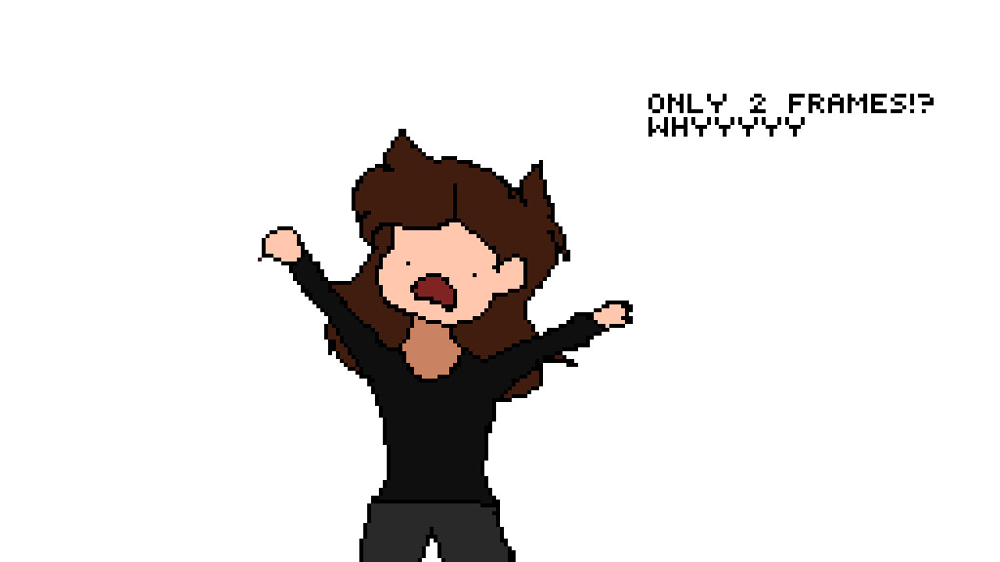

# GIFSyncer
Provides a slider for a loaded GIF to allow you to sync it to anything.  A rough BPM is provided

## For example:

This gif is at 120bpm and should sync up to music at 120bpm:

This gif is at 140bpm and should sync up to music at 140bpm:

This gif is at 300bpm and should sync up to music at 300bpm (or 150bpm (like [Head Splitter by Getter](https://www.youtube.com/watch?v=2YllipGl2Is))) but the gif reacts at twice the speed):

Big thanks to pixilart.com user [Peppermint](https://www.pixilart.com/peppermint) for the 2 frame gif that I've been experimenting with!

Definition of bits in a GIF: https://en.wikipedia.org/wiki/GIF#Animated_GIF

So, after a lot of experimenting, I figured out that the second byte of the two is longer.  It's this pattern: 1 = 256, 2 = 512, 3 = 768, 4 = 1024 ... 254 = 65025, 255 = 65280.  These were tested with an online editor loading them in and seeing what the delays were set to.  Just realized why the standard does that... It's because the first bit maxes out at 255/100ths of a second so the next one is 256 so you can make any number between that.  I still wish it gave me more decimal places in the first bit somehow so I could make like 51.2/100ths and get closer to BPM granularity.

For fun,  is a two frame GIF that lasts around 22 minutes (10.866666667 minutes per frame).

Found the spec! https://www.w3.org/Graphics/GIF/spec-gif89a.txt

Haven't found any more detail about the use of the second delay bit but I've figured out what it does so :shrug:
